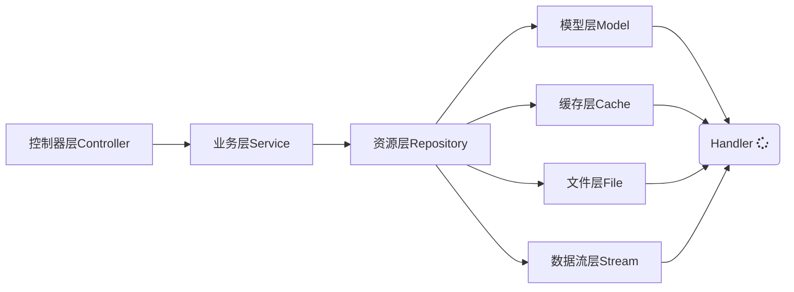

#### 前言

无论是大型、中型甚至小型项目，清晰的目录结构是开发过程的好的开始。项目架构设计包含项目目录结构规划，项目目录结构规划属于架构设计的基础，定义项目的目录结构非常重要，举个例子、好比如开发某个需求前落实并清楚地明白需求的交互与实现。


#### 项目目录结构分析

> 如下为一个基于 `Laravel` 常规、简洁的目录结构图( 已忽略某些`Laravel`目录 )
>
> 待补充完善 - TODO

```
├── app 															# Laravel框架的应用核心代码目录
│   ├── Common 												# 共有类目录
│   ├── Console												# 终端控制目录，根据业务或模块创建对应文件夹集成
│   │   ├── Commands
│   │   │   │── Algo
│   │   │   │   └── CmdCli.php
│   │   └── Kernel.php
│   ├── Enum  												# 枚举类层目录，譬如响应码表
│   │   └── CodeEnum.php
│   ├── Event 												# 事件目录
│   ├── Exceptions 										# 异常目录
│   │   └── Handler.php
│   ├── Helper 												# 辅助类，比如数组(ArrayHelper)、字符串(StringHelper)辅助类
│   ├── Http   												# HTTP层目录
│   │   ├── Controllers								#控制器层目录，根据业务或模块创建对应文件夹集成
│   │   │   ├── Algo
│   │   │   │   └── VideoAlgo.php
│   │   │   ├── BaseController.php 		# 务必建立控制器基类
│   │   ├── Kernel.php
│   │   └── Middleware 								#中间件目录
│   ├── Jobs 													# 队列
│   │   └── Queue.php
│   ├── Lib  													# 项目稍微常改动的库文件
│   ├── Listeners 										# 监听器目录
│   ├── Model 												# 模型层目录，根据业务或模块创建对应文件夹集成
│   │   ├── BaseModel.php 						# 务必构建模型基类
│   │   └── User.php
│   ├── Providers 										# 服务提供注册目录
│   │   ├── AppServiceProvider.php
│   │   ├── AuthServiceProvider.php
│   │   ├── BroadcastServiceProvider.php
│   │   ├── EventServiceProvider.php
│   │   └── RouteServiceProvider.php
│   ├── Repository 										# 资源层目录，根据业务或模块创建对应文件夹集成
│   │   └── CacheRepository.php
│   ├── Request 											# 请求句柄目录，根据业务或模块创建对应文件夹集成
│   │   └── DemoRequest.php
│   ├── Rules   											# 规则定义目录
│   │   └── Rule.php
│   ├── Service 											# 业务层目录，根据业务或模块创建对应文件夹集成
│   │   ├── BaseService.php 					# 务必构建业务基类
│   │   └── MessageService.php
│   ├── User.php
│   ├── Utils 												# 工具包类
│   └── Validator
├── config														# 配置文件目录
├── tests															# 单元测试目录
├── etc  															# 项目级别配置文件
├── sbin 															# 项目依赖或自定义可执行程序目录
└── lib  															# 库文件，比如ice
```


#### 流程设计模式

在架构设计中，比目录结构规划更深一层的就是**流程设计模式**，它与目录结构规划有着紧密的关系，每一个目录代表着对应的交互层，本质上、流程设计模式是面向对象的抽象化。

每个人对于项目架构的认知不一，但在 Team 开发项目时，必须统一开发模式甚至是架构。从代码的稳定性、灵活性以及健壮性而言，极力推荐使用 **Repository** 模式，各执其职、各层之间抽离解耦。大致流程简单表示为 `Controller` <=> `Service` <=>` Repository` <=> `Model | Cache | IOStream`。


###### 流程示例图

简洁版示例流程图如下图所示




###### 规范行为

- 每一个类文件各执其职，即表现为每一个类处理一种行为 或 一类型为
- 非相邻的层不允许进行直接的交互，必须按照约定的层交互请求访问


###### 缺点

- 类文件增加，对应的代码量稍微有所增加
- 增加一层资源层，流程上稍微复杂一点 

