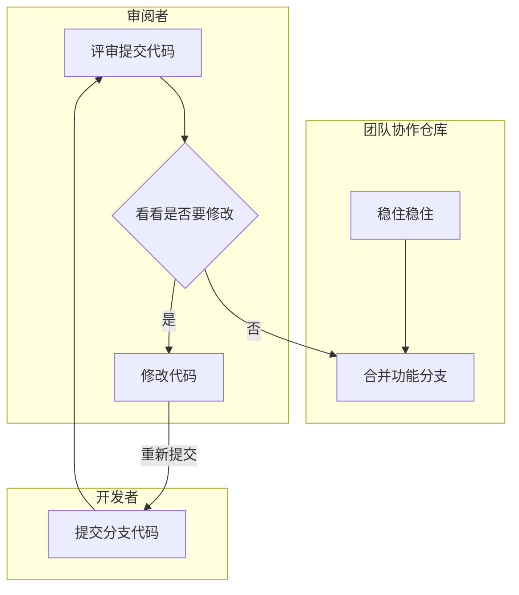

#### 背景

**`Code Review`** 可谓是互联网企业技术部门必备的基本要求。举个栗子，一个好的产品发开一定会存在产品迭代的过程，而一个稳、强的团队必然会有代码审查的流程。什么是代码审阅呢？简单而言，估计大家都知道：代码审阅者对编码者所编写代码进行查阅、评审。

软件工程学院的研究表明，程序员们会犯15-20种常见的错误。所以，通过把这些错误加入到检查清单当中，你可以确保不论什么时候，只要这些错误发生了，你就能发现它们，并且可以帮助你杜绝这些错误。当然这个更多的是针对团队开发，当你列举了这些清单的时候，你会发现这些清单具体的内容就是团队项目开发的标准、甚至是约定。

> 接下来我们深入认识代码审查，掌握为何做？何时做？如何做？

#### 为什么要代码审阅

俗话说，代码审阅与项目协作开发息息相关，少了它则，那就会导致项目开发流程没有形成闭环( 项目不完整、笑 )。从根本上而言，代码审阅是对团队的负责、更是对企业的责任。根据个人的代码审阅的经历，同一个团队、前期每次审阅时候、每次或多或少都存在问题，即使已经制定项目规范，问题可以分类为**代码问题** 与 **业务问题**，额额，这两个问题总结的似乎很废，但确实是这样。当然肯定要详细归纳分类，总结了一下，可以分为如下几类：

- 编码规范
- 技术实现
- 业务规范与实现
- 数据库规范
- 逻辑缺陷等

前期发现的问题大部分都是比较初级的问题，虽然是初级的问题，假设初级问题越多、项目年龄长，绝对会影响项目的扩展性、稳定性等，主要表现为业务迭代不灵活、开发困难。

经过三个月的定时( 小迭代 或 功能分支 )代码审阅，效果还是相当不错的！

- 第一、代码质量得到了很高的提升
- 第二、小问题越来越少、甚至可以规避( 响应加入开发规范 )
- 第三、团队之间业务、技术达成一致的共识

所以、**合理的代码审阅是必然的，是对项目代码的负责 以及 对产品的责任**，对于开发者而言、我们也可以从评审增长见识，提高开发者自身水平。

> 很有道理的一句话：项目开发流程缺少**项目规范** 与 **代码审阅** 最容易降低项目质量从而导致项目被重构。

#### 代码审阅的目标与原则

代码审查的目的在行业都是公认的，很简单：**提升代码的质量，尽早发现潜在的缺陷，降低修复的成本，同时可以促进开发团队内部知识的共享，帮助开发者更好理解系统的业务与实现**

对于代码审阅的原则而言，不定期地从小版本迭代( `version` ) 或 新功能( `feature` )进行团队或者相关人员进行评审，评审的维度从**架构、业务实现、技术**着手分析。

#### 代码审阅流程

大致的审查流程大致如下流程图所示，即

1. 开发者完成开发后，将功能分支提交并提醒审阅者进行代码审查
2. 评审者审阅代码，假设没有存在问题则让开发者将功能分支合并至开发分支，否则组织评审会，指出相应的不合理之处并讨论出可行方案进行更改
3. 开发者根据修改方案进行代码修复，完成后再次提交，返回 `1`

#### 代码审阅内容

###### 业务上

> 确保业务定义的功能正常运行 以及 业务后续的可迭代性

- 业务处理

  即功能实现是否能正常运行、满足预期的效果，同时确保业务的合理性 与 可迭代性。

- 业务规范

  使用正确的姿势正确处理业务，尽量禁止特殊处理 或者 歧义方式。

- 规范习惯

  必须编写并更新项目文档、接口文档。

  

###### 代码上

> 必须遵循项目规范，主要是从项目规范审阅，详细查看其它规范章节

- 命名规范
- 日志输出
- 代码注释
- 代码优化
- 数据库规范
- 事务处理
- 代码复用
- 效率与性能( 稳定性、健壮性 )
- 事务处理
- 项目架构目录定义规范
- 可读性、可维护性
- 代码安全性
- 单元测试
- … ...

#### 代码审阅工具

传送门 [程序猿必备的17款最佳的代码审查工具](https://baijiahao.baidu.com/s?id=1585905486202936778&wfr=spider&for=pc) 

一般代码审阅都是基于小版本 或 新功能，因而使用 `git`工具和 `IDE`即可。

#### 享受代码审阅

代码评审会 犹如 技术讨论分享会一样，从中我们总是可以从中获取收获高级的技术用法甚至是奇淫技巧😁，提高自身对代码的要求。

#### 注意代码审阅姿势

根据开发者提交的说明内容，所以比较代码务必遵循代码提交规范

合理安排代码审阅时间，一般安排1~2个小时。根据项目规范与产品规划**指出问题**、**讨论问题**、**解决问题**。

